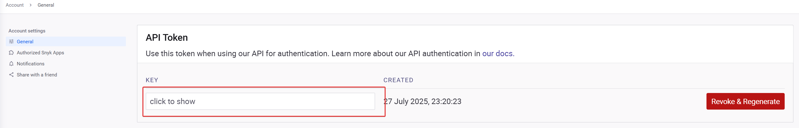
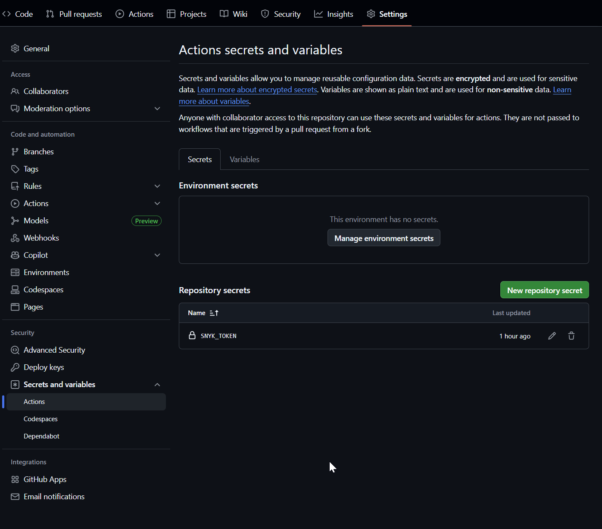
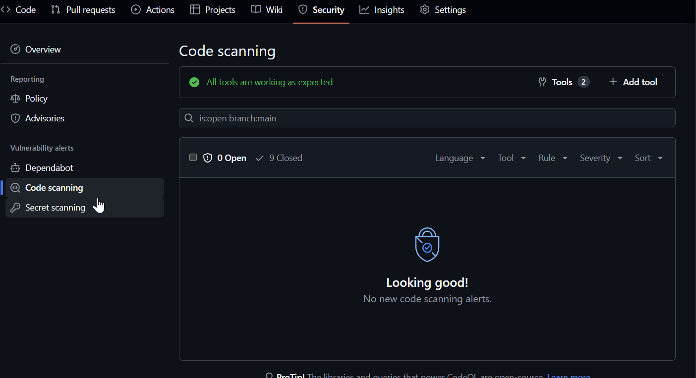

# Enable Advanced Security

- Dependency graph
  - Automatic dependency submission
- Dependabot
  - Dependabot alerts
  - Dependabot security updates
  - Dependabot version updates
- Code scanning
  - CodeQL


# Github Workflow

## CodeQL

```yml
name: "LibOrate CodeQL"

on:
  push:
    branches: ["main"]
  pull_request:
    branches: ["main"]
  schedule:
    - cron: "31 2 * * 0" # once a week On Sundays at 2:31 AM UTC

permissions:
  contents: read

jobs:
  analyze:
    name: Analyze (${{ matrix.language }})
    runs-on: ${{ (matrix.language == 'swift' && 'macos-latest') || 'ubuntu-latest' }}
    permissions:
      security-events: write
      packages: read
      actions: read
      contents: read

    strategy:
      fail-fast: false
      matrix:
        include:
          - language: actions
            build-mode: none
          - language: javascript-typescript
            build-mode: none
    steps:
      - name: Checkout repository
        uses: actions/checkout@v4

      - name: Initialize CodeQL
        uses: github/codeql-action/init@v3
        with:
          languages: ${{ matrix.language }}
          build-mode: ${{ matrix.build-mode }}

      - if: matrix.build-mode == 'manual'
        shell: bash
        run: |
          echo 'If you are using a "manual" build mode for one or more of the' \
            'languages you are analyzing, replace this with the commands to build' \
            'your code, for example:'
          echo '  make bootstrap'
          echo '  make release'
          exit 1

      - name: Perform CodeQL Analysis
        uses: github/codeql-action/analyze@v3
        with:
          category: "/language:${{matrix.language}}"
          upload: true
```

## Dependency Review

```yml
name: "Dependency Review"
on:
  pull_request:
    branches: ["main"]

permissions:
  pull-requests: write

jobs:
  dependency-review:
    runs-on: ubuntu-latest
    steps:
      - name: "Checkout Repository"
        uses: actions/checkout@v4
      - name: Dependency Review
        uses: actions/dependency-review-action@v4
        with:
          comment-summary-in-pr: true
```

## npm audit

Any vulnerabilities found by npm audit will make Github Actions fail.

```yml
- name: Run npm audit
  run: npm audit --audit-level=high
```

## SBOM

Generate a Software Bill of Materials (SBOM) for your project.

**It's not necessary for typescript projects because of Github's built-in support for typescript project. More details can be found in [this link](https://docs.github.com/en/code-security/dependabot/ecosystems-supported-by-dependabot/supported-ecosystems-and-repositories)**

```yml
name: Generate SBOM

on:
  push:
    branches: [main]
  pull_request:
    branches: [main]

permissions:
  contents: read

jobs:
  generate-sbom:
    runs-on: ubuntu-latest
    steps:
      - name: Checkout code
        uses: actions/checkout@v4

      - name: Generate SBOM with Anchore
        uses: anchore/sbom-action@v0
        with:
          path: .
```

## Synk

The adminstrator of the repository needs to create a Snyk account and generate an API token.

You can get the API token from https://app.snyk.io/account.



Then, you can add the API token as a secret in your repository.

`Settings` > `Secrets and variables` > `Actions` > `New repository secret`



```yml
name: Snyk Security

on:
  push:
    branches: ["main"]
  pull_request:
    branches: ["main"]

permissions:
  contents: read

jobs:
  snyk:
    permissions:
      contents: read # for actions/checkout to fetch code
      security-events: write # for github/codeql-action/upload-sarif to upload SARIF results
      actions: read # only required for a private repository by github/codeql-action/upload-sarif to get the Action run status
    runs-on: ubuntu-latest
    steps:
      - uses: actions/checkout@v4
      - name: Set up Snyk CLI to check for security issues
        # Snyk can be used to break the build when it detects security issues.
        # In this case we want to upload the SAST issues to GitHub Code Scanning
        uses: snyk/actions/setup@806182742461562b67788a64410098c9d9b96adb

        # For Snyk Open Source you must first set up the development environment for your application's dependencies
        # For example for Node
        #- uses: actions/setup-node@v4
        #  with:
        #    node-version: 20

        env:
          # This is where you will need to introduce the Snyk API token created with your Snyk account
          SNYK_TOKEN: ${{ secrets.SNYK_TOKEN }}

      - name: Synk auth
        run: snyk auth ${{ secrets.SNYK_TOKEN }}

        # Runs Snyk Code (SAST) analysis and uploads result into GitHub.
        # Use || true to not fail the pipeline
      - name: Snyk Code test
        run: snyk code test --sarif > snyk-code.sarif

        # Runs Snyk Open Source (SCA) analysis and uploads result to Snyk.
      - name: Snyk Open Source monitor
        run: snyk monitor --all-projects

        # Push the Snyk Code results into GitHub Code Scanning tab
      - name: Upload result to GitHub Code Scanning
        uses: github/codeql-action/upload-sarif@v3
        with:
          sarif_file: snyk-code.sarif
```

# Vulnerability alerts fix

## See alerts

`Security` > `Vulnerability alerts`

If below alerts is not empty, you need to fix them.


