# Secure Software Development Life Cycle (SSDLC)
Project Name: LibOrate
Organization: AImpower.org
Description: A videoconferencing companion app that offers emotional and relational support during video calls.

## 1. Planning & Requirements

- Task Management:

  We use GitHub Issues to capture feature requests, enhancements, and bug reports.
  
  Each issue includes labels (e.g., enhancement, beta-good-to-have) and acceptance criteria.

- Evidence: 

  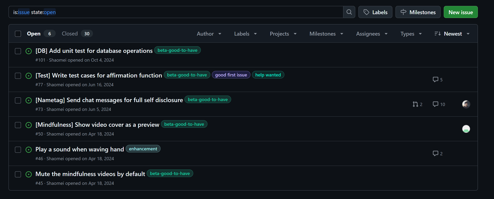

## 2. Design

- Designs are reviewed for security flaws.
- Use of secure design principles: least privilege, fail-safe defaults, input validation, etc.
- Architecture diagrams and data flow documentation are required before development starts.
- Evidence:

  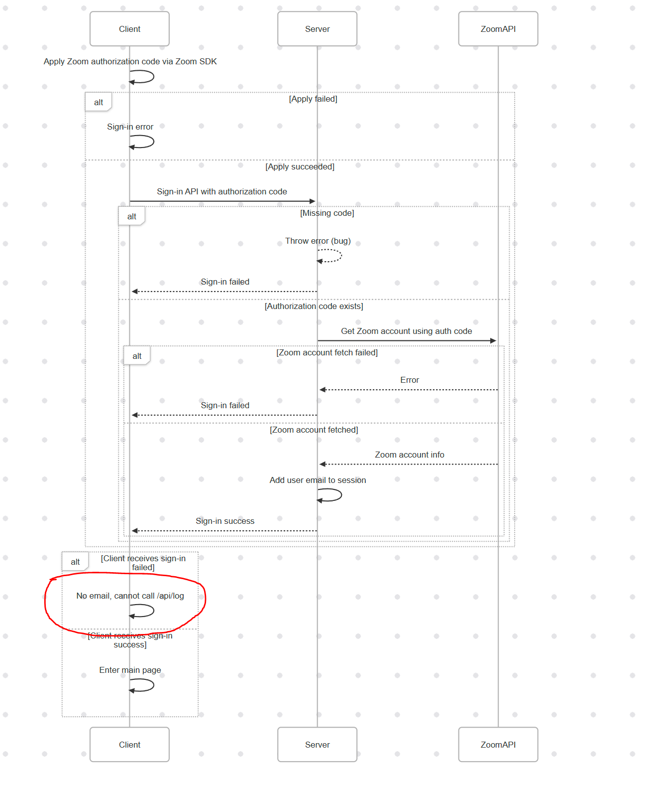

## 3. Implementation

- Branch Strategy:
  - We follow GitHub Flow. main is protected.
  All features/fixes are implemented via pull requests (PRs).

- Code Review:
  - Peer review is mandatory before merging.
  - Reviewers use GitHub's "Request Changes" or "Approve" features.

- Evidence:

  - PR Review

    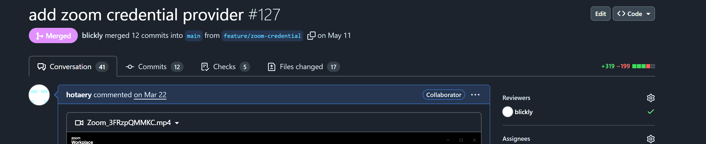
  
  - PR Approved

    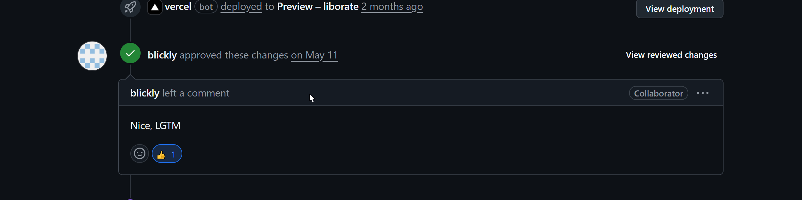

## 4. Testing
- Automated Tests:
  - We run unit tests and Cypress E2E tests on each PR and push.
  - Test results are validated in GitHub Actions.

- Evidence:

  - UT and cypress E2E tests

    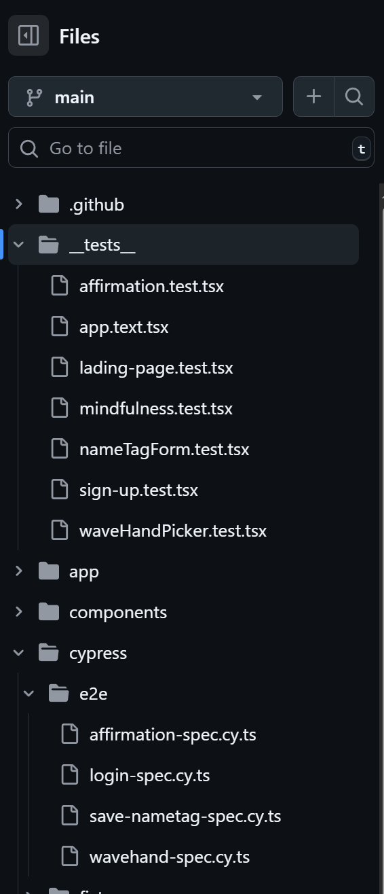
  
  - Run UT

    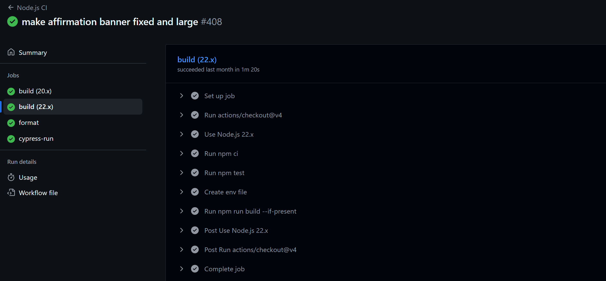

  - Run cypress E2E tests

    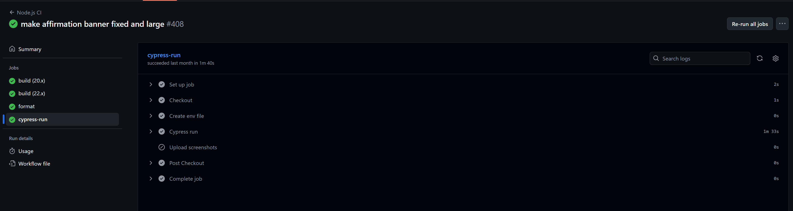

## 6. Security Practices
- Tools Used:
  - [npm audit](https://docs.npmjs.com/cli/v10/commands/npm-audit)
  - [Snyk](https://snyk.io/)
  - [GitHub Code Scanning (CodeQL)](https://codeql.github.com/)
  - [Dependabot](https://docs.github.com/en/code-security/supply-chain-security/keeping-your-dependencies-updated-automatically)
  - [Secret Scanning (GitHub Secrets)](https://docs.github.com/en/code-security/secret-scanning)
- Security Policy
  - SECURITY.md defines vulnerability reporting process.
- Evidence:
  
  - Security policy
  
    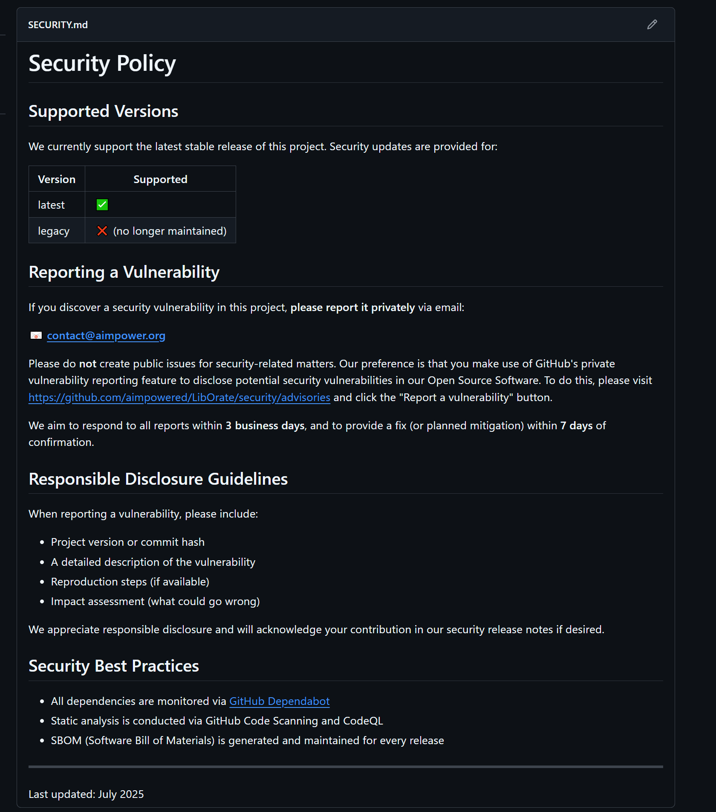

  - Github Dependabot Alert

    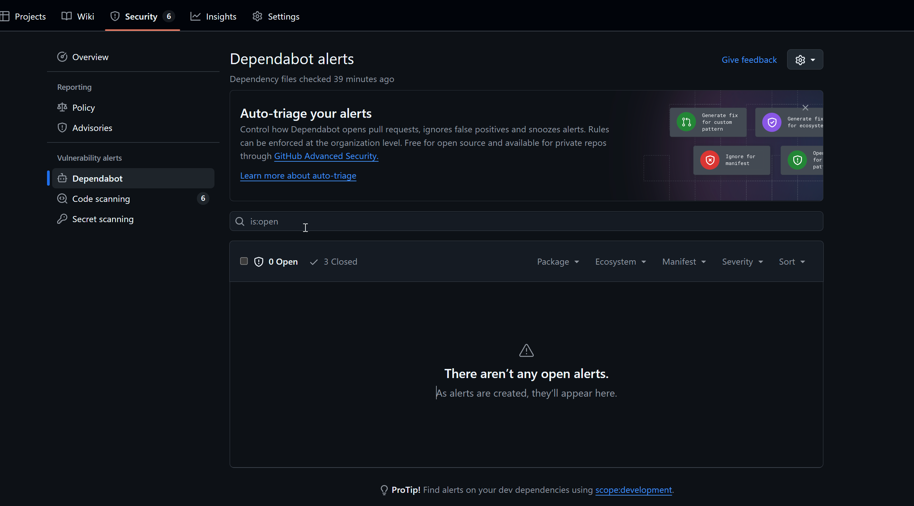

  - Code Scanning Alert

    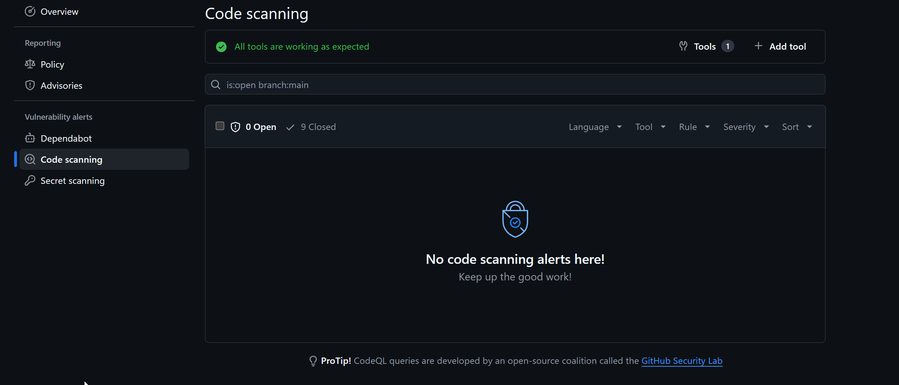

  - Secret Scanning Alert

    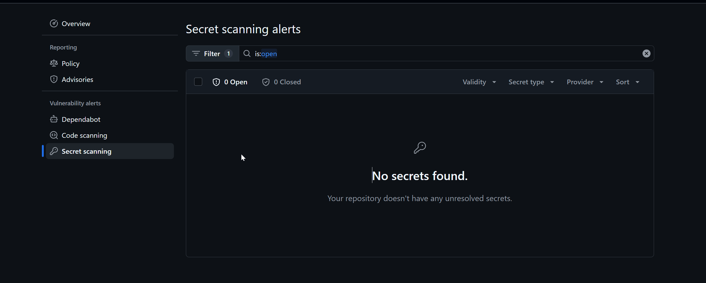

  - npm audit

    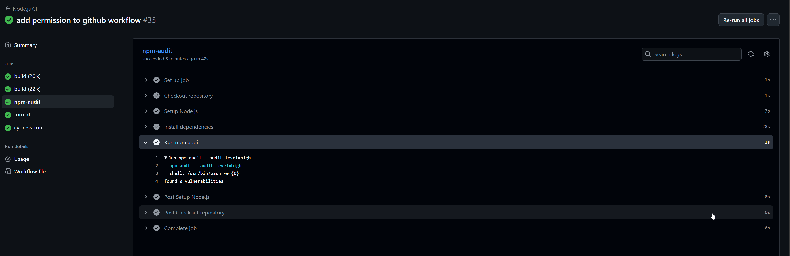

  - Integrate Snyk

    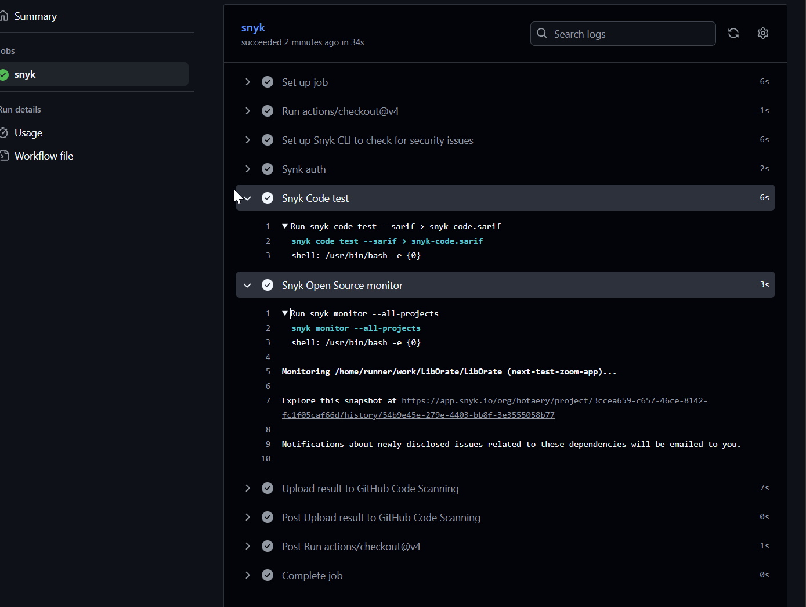

    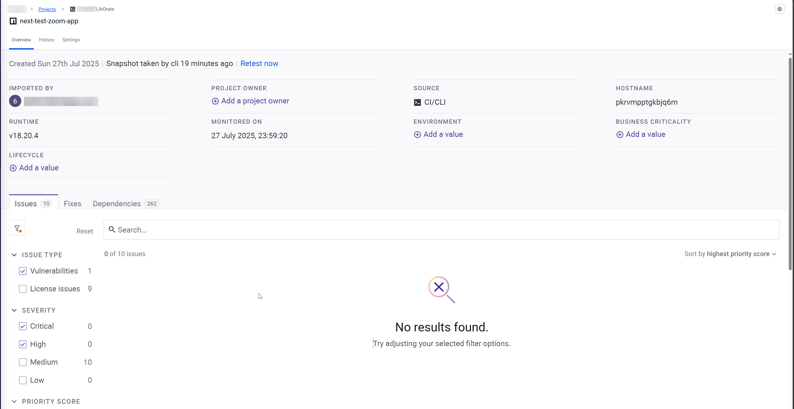

---

**Last reviewed:** July 2025  
**Owner:** AImpower.org
